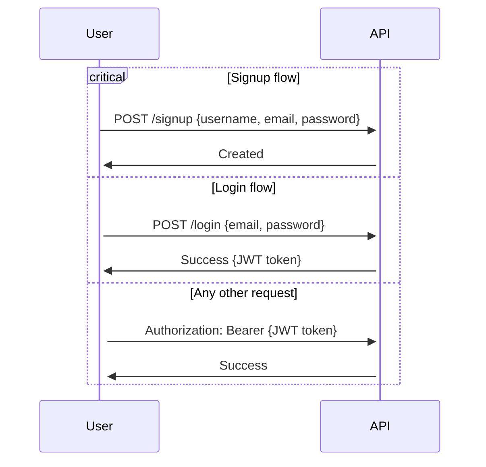

# Authentication

Authentication is based on [JWT tokens](https://jwt.io/introduction).

The steps to get authenticated are:

1. (first time) Register a new user with `POST /signup` giving an `email`, a `username` and a `password` in the JSON body
2. Login with an existing user with `POST /login` giving the `email` and `password` in the JSON body
3. Get the token from the response, if successful

In the next queries, to use the token, include it the `Authorization` header as a `Bearer`.

## Workflow

